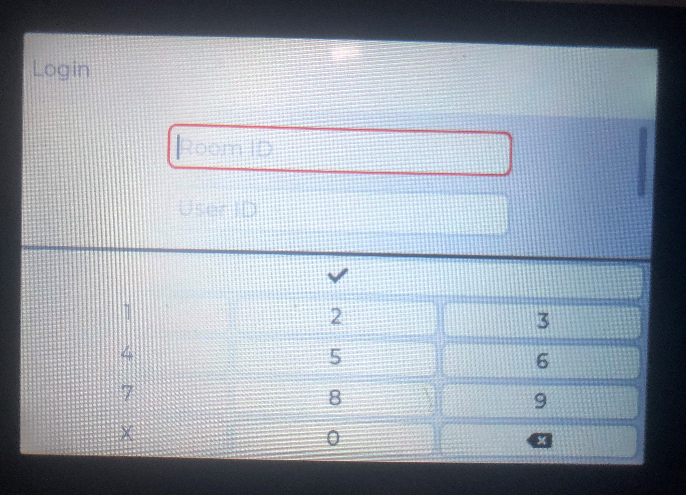
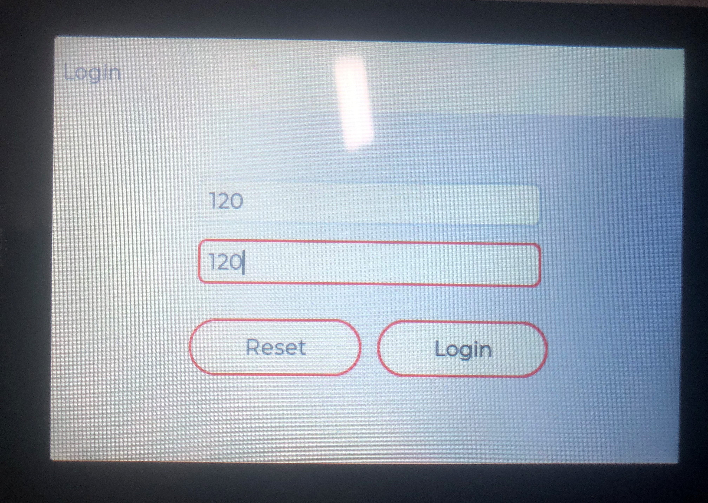
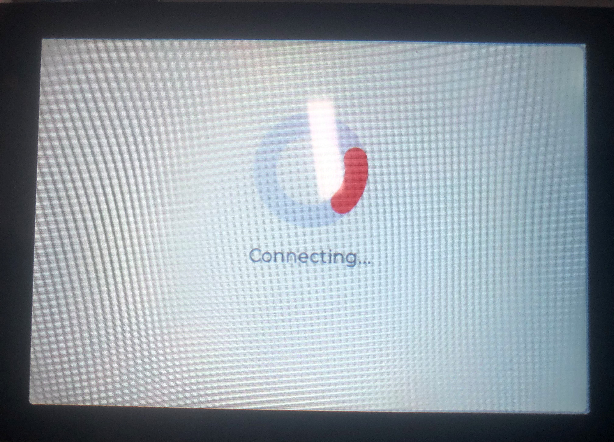
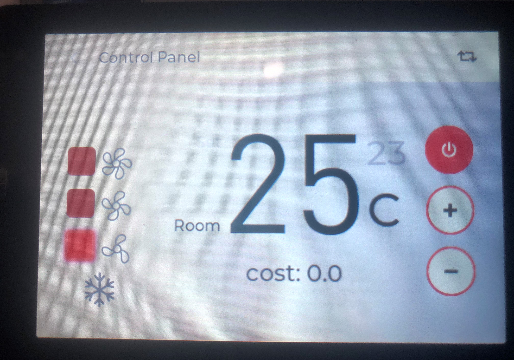

## 从机ESP32嵌入式端

### 开发语言

C

### 开发环境

Visual Studio 2019

Visual Studio Code

### 开发框架

ESP-IDF v4.2.1

LVGL v7.11

### 运行环境

wt32-sc01开发板（ESP32-WROVER-B模组、3.5寸LCD电容式触摸屏）

### 安装

ESP-IDF安装详情见ESP32官方教程

https://docs.espressif.com/projects/esp-idf/zh_CN/latest/esp32/get-started/index.html

### 配置&编译&下载

使用ESP-IDF对程序进行配置

```shell
idf.py menuconfig
```

* 进入Example Connection Configuration页面配置WiFi SSID和WiFi Password，即连接WiFi名称和WiFi密码。

* 进入Component config页面，选中最下方的MAGA configuration页面进入，配置Maga central server URI with port，即连接到的中央空调服务器主机端的URI地址，例如：ws://123.60.215.79:8000/ws/

使用ESP-IDF编译

```shell
idf.py build
```

使用ESP-IDF下载

```shell
idf.py -p <PORT> flash
```

### Visual Studio模拟器配置

代码中还附带了一个Visual Studio的模拟器，可以在不使用ESP32开发板的情况下演示LVGL图形界面的效果，使用时只需要在Visual Studio中打开simulator/lv_sim_visual_studio_sdl.sln工程文件运行即可。

### 效果演示

登录界面1



登录界面2



加载界面



控制面板界面


